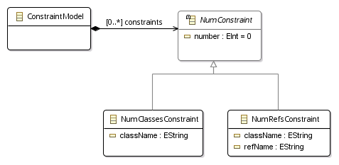
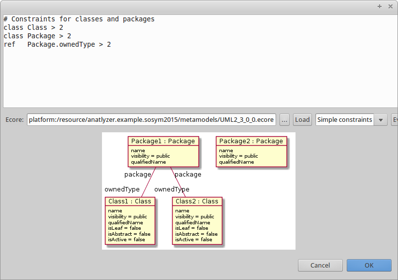

# Using AnATLyzer to check constraint satisfiability

## Using the GUI

Open a meta-model with an Ecore graphical editor. Right-click to open the pop-up menu and select "Select constraints".
This will open a dialog in which constraints can be entered and evaluated for satisfiability on the selected
meta-model.

For instance, the following image shows the dialog used to write constraints for the UML meta-model. 

 

The system is extensible to allow several constraint languages, but the default language is the OCL variant
implemented by ATL. As an example, the following constraint requires a model with at least three packages
in which at least one package has nested packages. This constraint is satisfiable, and thus an example
model is output by the system.

	-- You can write here your constraints
	-- For ATL, the meta-model is implicitly called MM
	MM!Package.allInstances()->size() > 3
	and
	MM!Package.allInstances()->exists(p | p.nestedPackage->size() > 1)

Now, let us consider the following constraint, in which all packages are required to
have nested packages. This formula is not satisfiable by a finite model. Therefore the
system indicates that the constraint is unsatisfiable. 

	MM!Package.allInstances()->size() > 3
	and
	MM!Package.allInstances()->forAll(p | p.nestedPackage->size() > 1)

## AnATLyzer as a model finder interface

The primary purpose of AnATLyzer is to be an static analysis tool for ATL. 
We have developed a lot of code to translate ATL expressions and EMF meta-models
to USE and to launch USE's model finder (USE Validator) transparently.

AnATLyzer provides an interface to allow others to take advantage of this feature to 
check the satisfiability of constraints written in other languages. This is done
by writing a translation from your constraint language to ATL/OCL. 

The following class provides a fluent API to invoke the model finder. It has configuration
methods to set the expression(s) which will be evaluated, the source meta-model and the
instance of the model finder to be used. Finally, the check method actually launches the
execution of the model finder.

	/* plugin: anatlyzer.atl.typing */
	package anatlyzer.atl.witness;

	public class ConstraintSatisfactionChecker {
		/* Configuration methods */ 
		public static ConstraintSatisfactionChecker withExpr(OclExpression expr) { ... }
		public static ConstraintSatisfactionChecker withExpr(Collection<OclExpression> exprs) { ... }
		public ConstraintSatisfactionChecker configureMetamodel(String mmName, Resource mmResource) { ... }
		public ConstraintSatisfactionChecker withFinder(IWitnessFinder finder) { ... }
		public ConstraintSatisfactionChecker check() { ... }	
		
		/* Query result mehods */
		public ProblemStatus getFinderResult() { ... }
		public IWitnessModel getWitnessModel() { ... }		
	}

If you want to reuse the model finder for expressions of a language different from ATL/OCL
you need, somehow, to convert expressions in your language into ATL/OCL expressions.

### Example: a simple constraint language

This example is available in project `anatlyzer.example.checkconstraints` within
the examples folder.

Let us define a simple constraint language in which it is possible
define the minimum number of instances of a given EClass and the minimum number
of elements that a reference need to have. The syntax is:

    # Constraints for UML packages
	class Package > 1
	ref   Package.packagedElement > 2

First, we define a meta-model with the abstract syntax of the language.

 

Next, we can define a parser to convert a piece of text into an abstract
syntax tree (a model conforming to the meta-model). A simple parser for this
language is defined in the class `anatlyzer.example.checkconstraints.SimpleConstraintsParser`
available in the example project. 

If you want to reuse the model finding interface for an existing language it is likely
that you don't need to write a parser or to define the meta-model. Instead, you can just
reuse the existing infrastructure of your target language.

The most important step is to define a translator between the abstract syntax of
your language and the abstract syntax of the OCL variant implemented by ATL. In
AnATLyzer this is defined as generated EMF classes in the `anatlyzer.atlext.OCL` package.

The following class implements the translation for the simple constraint language.

	public class SimpleConstraints2ATL {
		public static final String METAMODEL_NAME = "MM";
		
		public List<OclExpression> translate(ConstraintModel model) {
			ArrayList<OclExpression> expressions = new ArrayList<>();
			
			for (NumConstraint constraint : model.getConstraints()) {
				if ( constraint instanceof NumClassesConstraint ) {
					expressions.add(translate((NumClassesConstraint) constraint));
				} else if ( constraint instanceof NumRefsConstraint ) {
					expressions.add(translate((NumRefsConstraint) constraint));
				}
			}
			
			return expressions;
		}
	
	
		private OclExpression translate(NumClassesConstraint constraint) {
			OperationCallExp allInstances = createAllInstances(METAMODEL_NAME, constraint.getClassName());
			IntegerExp integerLiteral = createIntegerLiteral(constraint.getNumber());
			
			OperatorCallExp gte = OCLFactory.eINSTANCE.createOperatorCallExp();
			gte.setOperationName(">=");
			gte.setSource(allInstances);
			gte.getArguments().add(integerLiteral);
			
			return gte;
		}
		
		private OclExpression translate(NumRefsConstraint constraint) {
			OperationCallExp allInstances = createAllInstances(METAMODEL_NAME, constraint.getClassName());
			
			// Create the forAll: Type.allInstances()->forAll(obj | ...)
			IteratorExp forAll = OCLFactory.eINSTANCE.createIteratorExp();
			forAll.setName("forAll");
			forAll.setSource(allInstances);
			Iterator it = OCLFactory.eINSTANCE.createIterator();
			it.setVarName("obj");
			
			// Create the navigation: obj.referenceName
			NavigationOrAttributeCallExp nav = OCLFactory.eINSTANCE.createNavigationOrAttributeCallExp();
			nav.setName(constraint.getRefName());
			VariableExp varRef = OCLFactory.eINSTANCE.createVariableExp();
			varRef.setReferredVariable(it);
			
			IntegerExp integerLiteral = createIntegerLiteral(constraint.getNumber());
			
			OperatorCallExp gte = OCLFactory.eINSTANCE.createOperatorCallExp();
			gte.setOperationName(">=");
			gte.setSource(nav);
			gte.getArguments().add(integerLiteral);
			
			return gte;
		}
		
		private OperationCallExp createAllInstances(String mmName, String className) {
			OclModelElement classRef = OCLFactory.eINSTANCE.createOclModelElement();
			classRef.setName(className);
			
			OclModel model = OCLFactory.eINSTANCE.createOclModel();
			model.setName(mmName);
			classRef.setModel(model);
			
			OperationCallExp allInstancesCall = OCLFactory.eINSTANCE.createOperationCallExp();
			allInstancesCall.setOperationName("allInstances");
			allInstancesCall.setSource(classRef);
			
			return allInstancesCall;
		}
	
		private IntegerExp createIntegerLiteral(int num) {
			IntegerExp numLiteral = OCLFactory.eINSTANCE.createIntegerExp();
			numLiteral.setIntegerSymbol(num);
			return numLiteral;
		}	
	}

When you write your own translator you need to be very careful not to forget
to set all properties in the ATL model elements, because currently there is
validation step to ensure that the ATL abstract syntax is well constructed.
You will only see the errors via exceptions raised by internal AnATLyzer classes
(i.e., a null pointer exception if you forget to set e.g., the source property
of a property call expression) or by USE Validator if the expression is not
valid (e.g., it does type check).

Once the translator is ready, the integration consists in using the class
`ConstraintSatisfactionChecker` which implements a fluent API to configure
the model finder. The following is an example. Let us assume that the variable
`text` contains the constraints in the original language. We use the parser
to extract the abstract syntax model and the translator to get the corresponding
ATL/OCL expressions.

When configuring the `ConstraintSatisfactionChecker` class it is important to take
into account that you need to provide the EMF resource that contains the meta-model
that will be instantiated as part of the model finding process. Also, you need to
provide a name for the meta-model, which needs to be the name used by the translator
to create the OclModelElement objects (i.e., the name used in the ATL code generated
by the translator to refer to the input meta-model).

	String text = "..."; 
	
	SimpleConstraintsParser   parser = new SimpleConstraintsParser();
	SimpleConstraints2ATL translator = new SimpleConstraints2ATL();
	
	List<OclExpression> exprs = translator.translate(parser.parse(text));
	
	Resource mmResource = ... /* the resource containing the meta-model */

	String mmName = SimpleConstraints2ATL.METAMODEL_NAME;
	ConstraintSatisfactionChecker checker = ConstraintSatisfactionChecker.
		withExpr(exprs).
		withFinder(WitnessUtil.getFirstWitnessFinder()).
		configureMetamodel(mmName, mmResource).
		check();
	
	// Check satisfiability
	if ( AnalyserUtils.isConfirmed(checker.getFinderResult()) ) {
		// Do something with checker.getWitnessModel()
	} else if ( AnalyserUtils.isDiscarded(checker.getFinderResult()) ) {
		// The meta-model cannot be instantiated with the constraints
	} else if ( AnalyserUtils.isErrorStatus(checker.getFinderResult()) ) {
		// Internal errors, unsupported features, etc. (see the console)
	}
	

## Extending the dialog programmatically

You must add the `anatlyzer.ocl.ui` plug-in to the MANIFEST.MF dependencies.
Then, you must instantiate the `anatlyzer.ocl.ui.constraint_checker_language`.
This requires that you write a bridge class that transform a piece of text in
your constraint language into ATL/OCL.

If you have already implemented the translator and there is a parser available,
then writing the bridge is very simple. The following class is a bridge for
the example.

	public class SimpleConstraintsBridge implements IConstraintCheckerBridge {
	
		@Override
		public String getName() {
			return "Simple constraints";
		}
	
		@Override
		public TranslationResult translate(String text, Resource mmResource) {
			SimpleConstraintsParser parser = new SimpleConstraintsParser();
			ConstraintModel model;
			try {
				model = parser.parse(text);
			} catch (ParseError e) {
				return TranslationResult.error(e.getMessage());
			}
			
			SimpleConstraints2ATL translator = new SimpleConstraints2ATL();
			List<OclExpression> expressions = translator.translate(model);
			return new TranslationResult(expressions);
		}
	}

When you use the extension point there is no need to configure the model finder 
with the fluent API presented above. All the configuration is handled internally
by the user interface dialog.	

The following is an example of the simple constraint language integrated in the
evaluation dialog.

 

