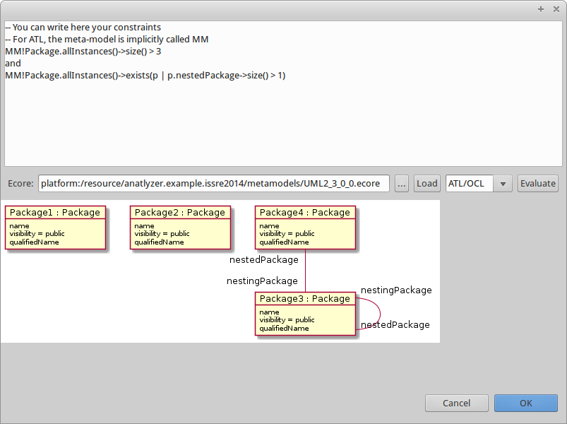

# Using AnATLyzer to check constraint satisfiability

## Using the GUI

Open a meta-model with an Ecore graphical editor. Right-click to open the pop-up menu and select "Select constraints".
This will open a dialog in which constraints can be entered and evaluated for satisfiability on the selected
meta-model.

For instance, the following image shows the dialog used to write constraints for the UML meta-model. 

 

The system is extensible to allow several constraint languages, but the default language is the OCL variant
implemented by ATL. As an example, the following constraint requires a model with at least three packages
in which at least one package has nested packages. This constraint is satisfiable, and thus an example
model is output by the system.

	-- You can write here your constraints
	-- For ATL, the meta-model is implicitly called MM
	MM!Package.allInstances()->size() > 3
	and
	MM!Package.allInstances()->exists(p | p.nestedPackage->size() > 1)

Now, let us consider the following constraint, in which all packages are required to
have nested packages. This formula is not satisfiable by a finite model. Therefore the
system indicates that the constraint is unsatisfiable. 

	MM!Package.allInstances()->size() > 3
	and
	MM!Package.allInstances()->forAll(p | p.nestedPackage->size() > 1)

## AnATLyzer as a model finder interface

The primary purpose of AnATLyzer is to be an static analysis tool for ATL.  

## Extending the dialog programmatically

